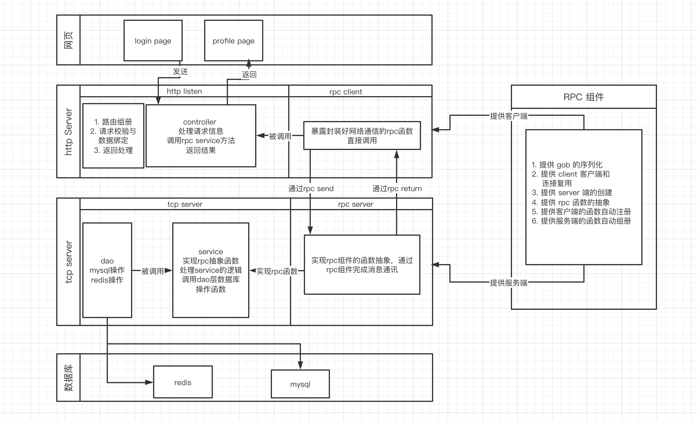
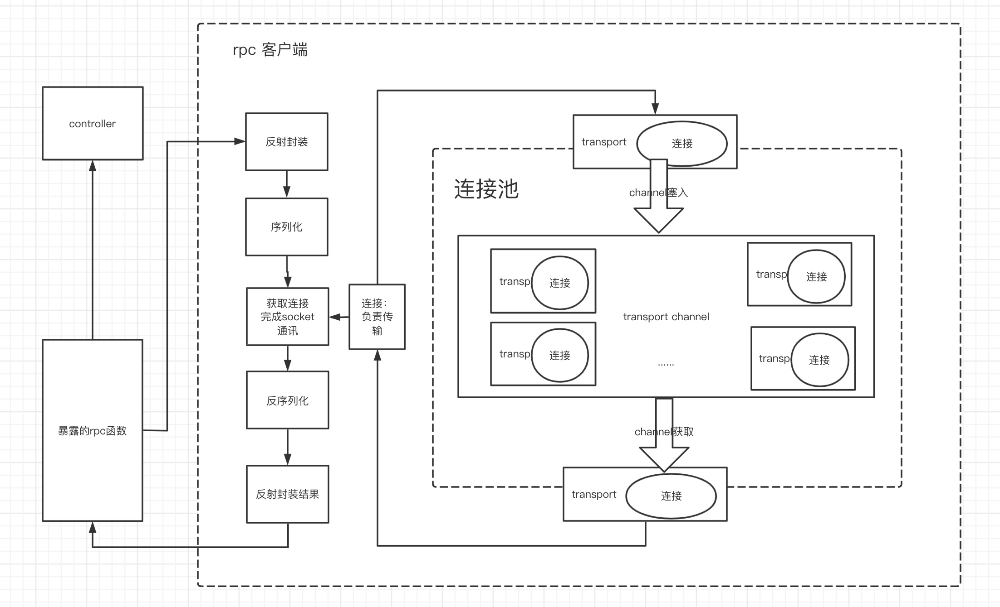
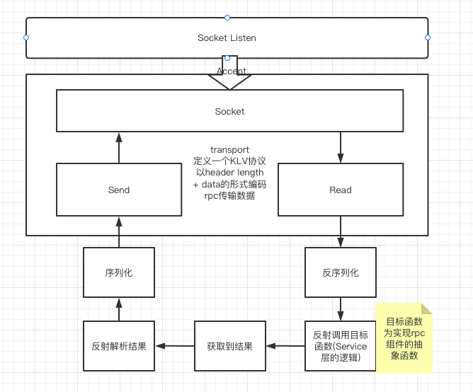
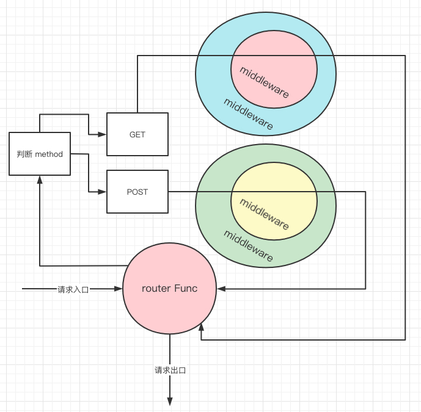
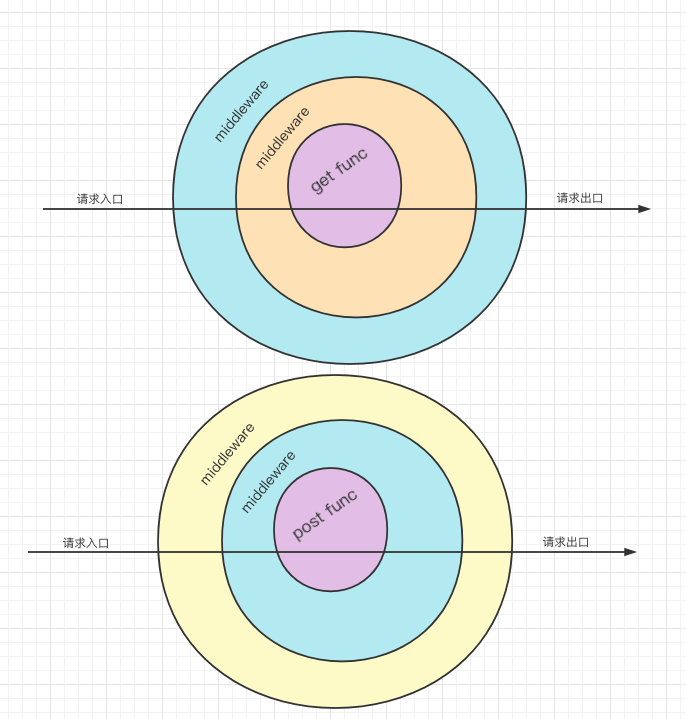

# 项目实现

## 整体架构




## RPC 设计

总体设计

Client通过反射实现为rpc函数绑定rpc的调用过程，中间通过获取封装好的连接池中的连接，发送序列化好gob二进制数据到 RPC Server 端。等待 RPC Server 放回结果后，反序列化和处理获取到结果。通过 RPC 函数绑定，函数的调用如同调用本地函数一样简单。



Server通过实现RPC函数的抽象，完成具体的RPC函数逻辑，监听 Client 端的请求并处理，将 Client 传输过来的数据反序列化，通过函数名获取 RPC Router 中的Map 中对应的函数，通过反射调用此函数，得到调用结果后，进行序列化返回给 Client 端



### RPC 自动注册
```go
// ClientAutoRegister 客户端的自动注册
func ClientAutoRegister(cli *client.Client, rpcFunction *function.RPCFunction) {
	valueOf := reflect.ValueOf(rpcFunction).Elem()
	typeOf := valueOf.Type()
	numField := valueOf.NumField()
	for i := 0; i < numField; i++ {
		name := typeOf.Field(i).Name
		fn := valueOf.Field(i)
		cli.CallRPC(name, fn.Addr().Interface())
	}
}

// ServerAutoRegister 服务端的自动注册
func ServerAutoRegister(sr *server.RPCServer, rpcFunction *function.RPCFunction) {
	valueOf := reflect.ValueOf(rpcFunction).Elem()
	typeOf := valueOf.Type()
	numField := valueOf.NumField()
	for i := 0; i < numField; i++ {
		name := typeOf.Field(i).Name
		fn := valueOf.Field(i).Interface()
		sr.Register(name, fn)
	}
}
```
通过自动注册优化增加 RPC 函数的编码数量，只需添加新的 RPC 函数并发 function.RPCFunction 中添加此函数即可。Client 端调用 RPC 方法的时候就像在调用一个普通的方法一样便捷，而函数绑定、序列化与 TCP 传输都在组件内部完成。


rpc/dataserial/data.go 是对序列化的封装

rpc/transport/transport.go 是 TLV decode 和 encode 并通过 socket 接受发送的封装

rpc/function/function.go 是抽象函数的封装

rpc/register/register.go 自动组册的封装

rpc/client/client.go 是对 rpc 客户端的封装

rpc/server/server.go 是对 rpc 服务端的封装


## HTTP 核心设计

#### 总体设计

##### 先说原生实现所存在的问题

因为 HandlerFunc 的设计类似洋葱模型，以层次递进的，原生实现的路由组册不带请求方法的组册，在实际开发中可能会存在GET方法和POST方法所用的鉴权 middleware 不同，而如果使用默认实现的路由，会造成 middleware 的层次关系混乱。

如图所示



##### 去解决这个路由问题

而为了开发降低代码的耦合度，我们期待在路由组册所实现的模型如下图所示。



路由组册设计，实现这个设计，我们要实现对同一个 URL 对方法对区分，于是我们定义一个 map[string]handleFunc 来实现这个功能，而 key(string) 为 [method:url] 如 POST:/api/login ，为了确定 method 是否支持，我们还要设计一个 map[url]int 来实现。同时通过 bitmap 来确定方法是否支持。

```go
map[string]int{
    http.MethodGet:    1 << 0,
    http.MethodPost:   1 << 1,
    http.MethodPut:    1 << 2,
    http.MethodDelete: 1 << 3,
}
```

对于一个 url ，如果是GET方法，需要对 method Map 中对 method[url] | http.MethodGet( 1<<0 )，此时 method[url] = 0001，如果又支持Post 方法 method[url] | http.MethodPost(1 << 1)，此时 method[url] = 0011，而判断一个方法是否被支持只需要 method[url] & http.MethodGet 如果等于 1 则是被支持，0 则是不支持。之后找到对应注册的 handleFunc 即可，逻辑如下

```go
func (s *HttpServer) ServeHTTP(w http.ResponseWriter, r *http.Request) {
	start := time.Now()
	path := r.URL.Path
	if code, ok := s.method[path]; ok {
		method := r.Method
		if s.reqMethod[method]&code == 0 {
			http.Error(w, "405 method not allowed", http.StatusMethodNotAllowed)
			end := time.Now()
			log.Println("[YuanCheng] | 405 | ", s.Addr, " | ", end.Sub(start).String(), " | ", method, path)
			return
		}
		route := fmt.Sprint(method, ":", path)
		if handler, ok := s.router[route]; ok {
			w.Header().Set("Content-Type", "application/json")
			handler.ServeHTTP(w, r)
			end := time.Now()
			log.Println("[YuanCheng] | 200 | ", s.Addr, " | ", end.Sub(start).String(), " | ", method, path)
		}
	} else {
		http.NotFound(w, r)
		end := time.Now()
		log.Println("[YuanCheng] | 404 | ", s.Addr, " | ", end.Sub(start).String(), " | ", path)
	}
}

func (s *HttpServer) addRoute(method string, route string, f http.HandlerFunc) {
	s.method[route] = s.method[route] | s.reqMethod[method]
	sprint := fmt.Sprint(method, ":", route)
	if _, ok := s.router[sprint]; ok {
		log.Println(method, " Method : '", route, "' is exist")
		return
	}
	s.router[sprint] = f
}
```

如此即可完成我们所需要的路由组册设计。


此外为了方便数据校验，设计了数据和绑定设计。根据 golang 的 tag 设计。我们为我们需要自动校验和填充的结构体定义两个 tag ，json 和 pattern，一个是对应请求的 form data 的 key 和请求参数要求匹配的 pattern。例如

```go
type UserPostInput struct {
	Name     string `json:"name" pattern:"^[a-zA-Z0-9_-]{6,15}$"`
	Password string `json:"password" pattern:"^().{6,20}$"`
}
```

之后通过 bind.Struct 函数来实现绑定，例

```go
func Handler(w http.ResponseWriter, r *http.Request) {
	// 参数绑定与校验
	input := UserPostInput{}
	if err := bind.Struct(r, &input); err != nil {
		return
  }
}
```

```go
func Struct(r *http.Request, i interface{}) error 
```

此方法会根据 json 与 pattern 实现数据绑定。

#### server

File: http/server/server.go

##### struct

###### HttpServer

```go
type HttpServer struct {
	Addr      string
	router    map[string]http.HandlerFunc
	method    map[string]int
	reqMethod map[string]int
}
```

##### Function

```go
func NewHttpServer(addr string) *HttpServer
func (s *HttpServer) ServeHTTP(w http.ResponseWriter, r *http.Request)
func (s *HttpServer) Run()
func (s *HttpServer) addRoute(method string, route string, f http.HandlerFunc)
func (s *HttpServer) GET(route string, f http.HandlerFunc)
func (s *HttpServer) POST(route string, f http.HandlerFunc)
func (s *HttpServer) PUT(route string, f http.HandlerFunc)
func (s *HttpServer) DELETE(route string, f http.HandlerFunc)
```

###### NewHttpServer

返回一个httpServer结构体

```go
reqMethod: map[string]int{
			http.MethodGet:    1 << 0,
			http.MethodPost:   1 << 1,
			http.MethodPut:    1 << 2,
			http.MethodDelete: 1 << 3,
}
```

核心部分介绍，这部分是用来标记某个URL所支持的方法，HttpServer.method 存储所支持的方法都 code。初始化为0，如果添加某个方法，就将 code 与reqMethod[方法]位于算或，判断此方法是否支持则用 code 与 reqMethod[方法]位运算与，结果为0则为不支持。

###### ServeHTTP

为http监听的封装的具体实现，实现路由转化

###### Run

启动服务

###### addRoute

为GET/POST/...等方法提供统一的路由注册逻辑

###### GET

注册GET方法HandlerFunc

###### POST

注册POST方法HandlerFunc

###### PUT

注册PUT方法HandlerFunc

###### DELETE

注册DELETE方法HandlerFunc

#### bind

File: http/bind/bind.go

##### Function

```go
func Struct(r *http.Request, i interface{}) error {
    v := reflect.ValueOf(i).Elem()
    t := v.Type()
    for i := 0; i < v.NumField(); i++ {
        field := v.Field(i)
        fieldType := t.Field(i)
        tag := fieldType.Tag
        
        // json获取
        jsonName := tag.Get("json")
        s := r.FormValue(jsonName)
        
        // 正则校验
        pattern := tag.Get("pattern")
        if pattern != "" {
            match, err := regexp.Match(pattern, []byte(s))
            if err != nil {
                return err
            }
            if !match {
                return errors.New(fmt.Sprint(fieldType.Name, " param is regexp match ", pattern))
            }
        }
        
        err := setValue(s, field)
        if err != nil {
            return err
        }
    }
    return nil
}
```

###### Struct

提供从request中获取请求参数，i 为 &model，在model struct 中标记tag:json(请求参数的变量名) tag:pattern(校验的正则)，通过反射完成数据的校验与填充。


## TCP设计

维护 rpc Server 并实现 rpc 抽象函数，完成对应的数据库操作逻辑